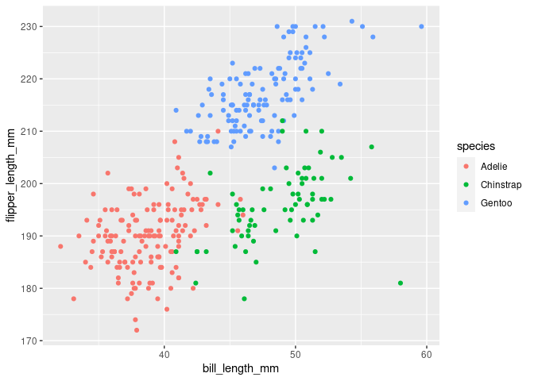

p8105\_hw1\_tg2753
================
Tianchuan Gao

## Problem 1

Create a data frame comprised of:  
- a random sample of size 10 from a standard Normal distribution  
- a logical vector indicating whether elements of the sample are greater
than 0  
- a character vector of length 10  
- a factor vector of length 10, with 3 different factor “levels”

``` r
df = tibble(
  random_sample = rnorm(10),
  logical_vec = random_sample > 0,
  character_vec = c("a", "b", "c", "d", "e", "f", "g", "h", "i", "j"),
  factor_vec = c("bad", "bad", "bad", "mid", "mid", "mid","mid", "good", "good", "good")
    )
```

take the mean of each variable in the dataframe

``` r
mean(pull(df, random_sample))
```

    ## [1] -0.2234395

``` r
mean(pull(df, logical_vec))
```

    ## [1] 0.3

``` r
mean(pull(df, character_vec))
```

    ## Warning in mean.default(pull(df, character_vec)): argument is not numeric or
    ## logical: returning NA

    ## [1] NA

``` r
mean(pull(df, factor_vec))
```

    ## Warning in mean.default(pull(df, factor_vec)): argument is not numeric or
    ## logical: returning NA

    ## [1] NA

We can see from the above results that we can take mean for numerical
and logical variables while not for character or factor variables

``` r
as.numeric(pull(df, logical_vec))
as.numeric(pull(df, character_vec))
as.numeric(pull(df, factor_vec))
```

I can convert logical variables into numerical outcomes 0 or 1.  
But I cannot convert character or factor variables into numerical
variables.  
This helps explain why I cannot take the mean for character or factor
variables.

## Problem 2

Load Dataset

``` r
data("penguins", package = "palmerpenguins")
```

Write a short description of the penguins dataset including:  
-the data in this dataset, including names / values of important
variables

``` r
summary(penguins)
```

    ##       species          island    bill_length_mm  bill_depth_mm  
    ##  Adelie   :152   Biscoe   :168   Min.   :32.10   Min.   :13.10  
    ##  Chinstrap: 68   Dream    :124   1st Qu.:39.23   1st Qu.:15.60  
    ##  Gentoo   :124   Torgersen: 52   Median :44.45   Median :17.30  
    ##                                  Mean   :43.92   Mean   :17.15  
    ##                                  3rd Qu.:48.50   3rd Qu.:18.70  
    ##                                  Max.   :59.60   Max.   :21.50  
    ##                                  NA's   :2       NA's   :2      
    ##  flipper_length_mm  body_mass_g       sex           year     
    ##  Min.   :172.0     Min.   :2700   female:165   Min.   :2007  
    ##  1st Qu.:190.0     1st Qu.:3550   male  :168   1st Qu.:2007  
    ##  Median :197.0     Median :4050   NA's  : 11   Median :2008  
    ##  Mean   :200.9     Mean   :4202                Mean   :2008  
    ##  3rd Qu.:213.0     3rd Qu.:4750                3rd Qu.:2009  
    ##  Max.   :231.0     Max.   :6300                Max.   :2009  
    ##  NA's   :2         NA's   :2

-the size of the dataset (using nrow and ncol)  
the dataset has 344 rows, 8 columns.

-the mean flipper length  
the mean of the flipper length is 200.9152047 months.

Make a scatterplot of flipper\_length\_mm (y) vs bill\_length\_mm (x);
color points using the species variable

``` r
ggplot(penguins, aes(x = bill_length_mm, y = flipper_length_mm, color = species)) + geom_point()
```

    ## Warning: Removed 2 rows containing missing values (geom_point).

<!-- -->

Export your first scatterplot to your project directory using ggsave

``` r
ggsave("scatter_plot.pdf", height = 4, width = 6)
```

    ## Warning: Removed 2 rows containing missing values (geom_point).
